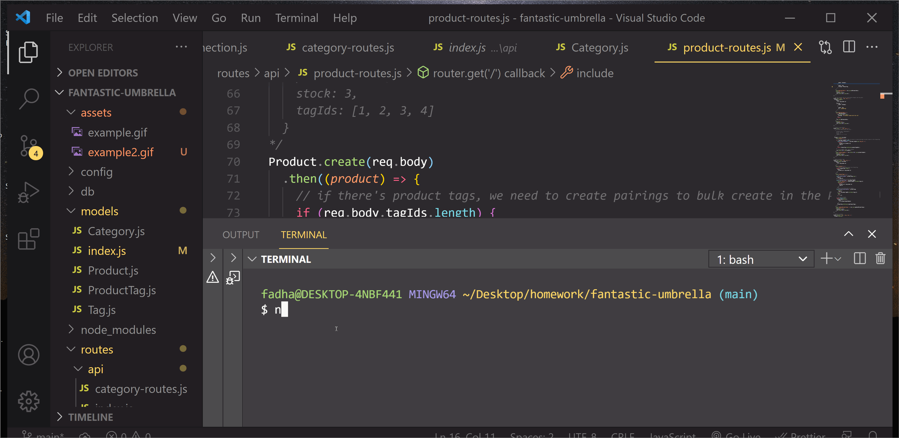

# Tittle 
E-commerce Back End .

# Description
 an application that can be used to preset database and then connect to it by API calls and perform operations on the different entries. for Example Categories , Tags and Products. in this application and as a backend user can perform various CRUD operations on these tables via API calls:
 01-GET routes to return all categories, all products, and all tags.
 02-GET routes to return a single category, single product, and single tag.
 03-PUT routes to update a product tag id and update a category or tag name.
 04-POST routes to create a new category, new product, and new tag.
 05-DELETE routes to delete a single category, single product, and single tag.

# Table of contents :
github email LICENSE

# Author :
name : Fadhaa Abdullah
Email: fadhaaabdullah8991@gmail.com
Github page: Fadhaa89

# My Links :
Repo Link :
https://github.com/fadhaa89/e-commerce

# Visuals :

